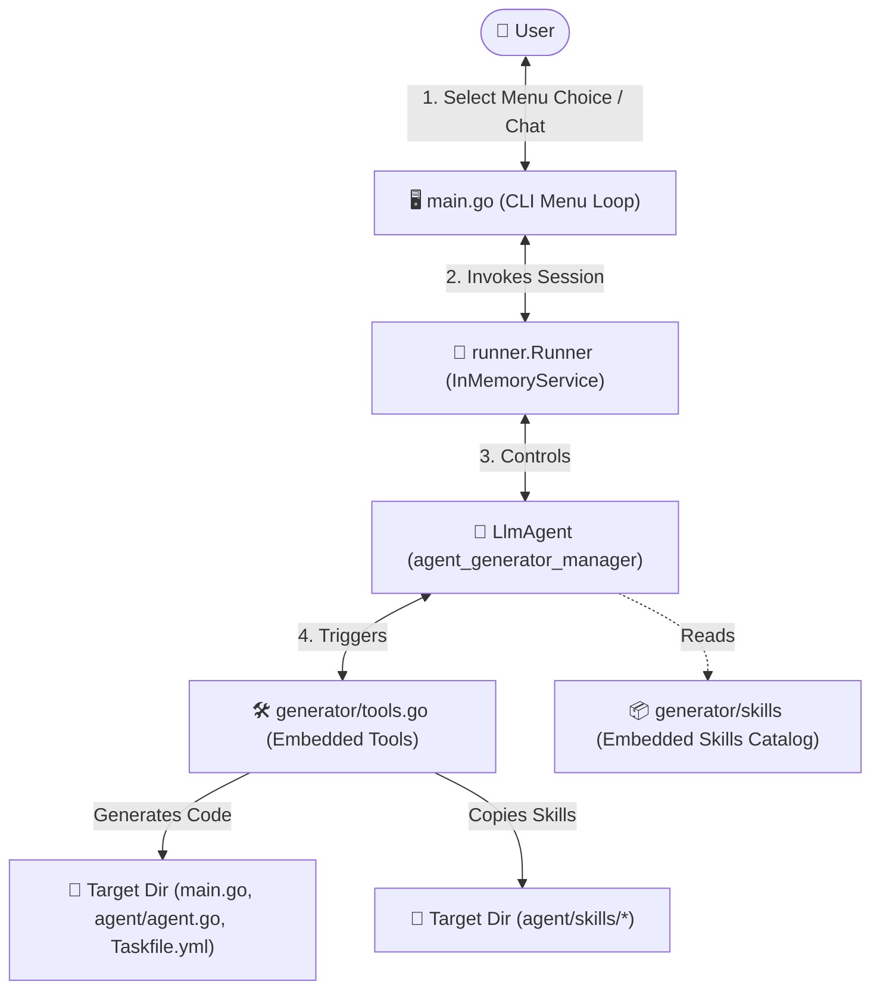

# 🤖 Go ADK Agent Generator & Manager Combine

[](https://golang.org)
[](https://github.com/google/agents-bar)
[](LICENSE)

An all-in-one interactive combine utility for creating, scaffolding, and managing Google Agent Development Kit (ADK) v2.0 projects, managing custom agent skills, and generating Open Knowledge Format (OKF) documentation in Go.

This application combines a **structured CLI menu** with a **conversational AI agent assistant** that conducts an interview, gathers parameters, and runs embedded local tools to generate production-ready configurations.

---

## 📐 Architecture & Flow

The following diagram illustrates how the CLI menu, ADK runner session, AI agent, and local tools interact to generate code and manage skills:



---

## 🛠️ Key Features

*   **Self-Contained Portability (`go:embed`):** The entire application compiles into a single static binary. All file templates and the skills catalog are embedded at compile time using Go's `embed` package.
*   **Go ADK v2.0 Scaffolding:** Generates Go directories, client initialization boilerplate, and table-driven unit tests following Google's Go engineering conventions. Includes dynamic Vertex AI fallback configurations.
*   **Structured Output & Schema Support:** Fully supports defining strongly typed schemas (`*genai.Schema`) for agents, mapping fields, and extracting structured JSON payloads from session state via a standard-library JSON helper.
*   **Decoupled Skills Installer:** Copies or installs embedded modular skills into the global directory (`~/.agents/skills/`) or any custom local workspace directory.
*   **OKF Documentation Creator:** Generates structured metadata, indices (`index.md`), and update histories (`log.md`) following the Open Knowledge Format spec.
*   **Conversational Interface:** Integrated with an ADK runner session (`runner.Runner` with `InMemoryService`) allowing the agent to ask clarification questions and call tools on-demand.

---

## 📂 Project Structure

- [main.go](file:///home/zhenya/projects/personal/agent-generator/main.go): The entry point managing the CLI interactive menu loop and ADK runner execution session.
- [Taskfile.yml](file:///home/zhenya/projects/personal/agent-generator/Taskfile.yml): Contains automation commands for tidying, running, building, and testing.
- [generator/](file:///home/zhenya/projects/personal/agent-generator/generator):
  - [skills/](file:///home/zhenya/projects/personal/agent-generator/generator/skills): Embedded directory containing reusable Markdown skills.
  - [agent.go](file:///home/zhenya/projects/personal/agent-generator/generator/agent.go): Manager agent definition and system instruction configuration.
  - [templates.go](file:///home/zhenya/projects/personal/agent-generator/generator/templates.go): Go templates for scaffolding files (such as `main.go`, `agent.go`, `Taskfile.yml`).
  - [tools.go](file:///home/zhenya/projects/personal/agent-generator/generator/tools.go): Core tool handlers (`scaffold_go_agent`, `generate_okf_wiki`, `install_skills`, `update_agents_cli`).
  - [tools_test.go](file:///home/zhenya/projects/personal/agent-generator/generator/tools_test.go): Robust, adversarial table-driven unit tests.

---

## 📦 Embedded Skills Catalog

The generator embeds 10 reusable agent skills inside [/generator/skills/](file:///home/zhenya/projects/personal/agent-generator/generator/skills), which can be injected into new agents or installed globally:

| Skill Directory | Purpose | Key Content Covered |
| :--- | :--- | :--- |
| `go-adk-workflow` | Go ADK v2.0 developer lifecycle. | Scaffolding, testing, console mode, and debugging. |
| `go-adk-code` | Code references for Go ADK. | Client initialization, custom OpenAI/Copilot adapters, **Structured Output (Schema & Key)**. |
| `go-adk-deploy` | Packaging and cloud deployment. | Multi-stage Docker builds, Cloud Run deployment, Secret Manager setups. |
| `adk-go-coder` | Guidelines for Go coding adapters. | Models, subcommands, and quick bootstrap templates. |
| `okf-creator` | Rules for building structured wikis. | Spec details for Open Knowledge Format wikis. |
| `okf-server-creator` | GraphQL/REST Wiki server guides. | Building servers to read and query OKF documentation. |
| `skill-creator` | Framework for generating new skills. | Step-by-step instructions on making custom `.md` skills. |
| `blog-writer` | Styling rules for rich blog posts. | Tailwind layout systems and typography conventions. |
| `content-research-writer` | Internet research methodology. | Parsing web pages and extracting key data. |
| `seo-checklist` | Checklist items for SEO checks. | Optimization, header ordering, semantic HTML. |

---

## 🚀 Getting Started

### Prerequisites

*   **Go:** Version 1.23+ (project uses `1.26.1`).
*   **Gemini API Key:** Get a `GOOGLE_API_KEY` from Google AI Studio.
*   **Task Runner:** Highly recommended for task execution (install via `go install github.com/go-task/task/v3/cmd/task@latest` or package managers).

### Setup

1. Copy `.env.example` to `.env` and fill in your API credentials:
   ```bash
   cp .env.example .env
   ```
2. Open [.env](file:///home/zhenya/projects/personal/agent-generator/.env) and populate the values:
   ```env
   GOOGLE_API_KEY="AIzaSyYourActualKeyHere..."
   GEMINI_MODEL="gemini-2.5-flash"
   ```
3. Download and tidy dependencies:
   ```bash
   task tidy
   ```

---

## 🤖 Usage Reference

To start the interactive combine console:
```bash
task run
```
Or run directly using Go:
```bash
go run main.go
```

### Menu Options

```
Select an option:
[1] Scaffold a new Go ADK v2.0 Agent project
[2] Generate OKF Documentation Bundle
[3] Install or Copy Agent Skills (Global/Local)
[4] Update agents-cli skills and rewrite them for Go ADK v2.0
[5] Talk with the Assistant (Free Chat)
[6] Exit
```

#### Option 1: Scaffold a Go Agent
Starts a conversation with the generator. The agent will ask you for:
*   **TargetPath:** Absolute target folder where the project files will be created.
*   **ModuleName:** Go module name (e.g. `github.com/username/project`).
*   **AgentName:** Structural name for the agent client.
*   **ModelName:** Gemini model to load (defaults to `gemini-2.5-flash`).
*   **WithSkills:** Yes/No, copies all embedded skills to the target agent folder under `agent/skills/`.

Once confirmed, the agent calls the `scaffold_go_agent` tool, generates the codebase, and triggers `go mod tidy` in the target directory.

#### Option 2: Generate OKF Documentation
Converts an API, dataset, or BigQuery table into an OKF catalog. The agent asks for:
*   **TargetPath:** Target directory for the bundle.
*   **Title:** Display name.
*   **Category:** Subdirectory category (e.g. `tables`, `apis`).
*   **Fields JSON:** Table columns with types and descriptions.

The agent calls `generate_okf_wiki` and writes `index.md`, `log.md`, and the formatted table markdown file.

#### Option 3: Install Agent Skills
Copies the embedded `.md` skills to your global workspace directory or a local project. The agent asks for the destination path (defaults to global path `~/.agents/skills`) and which skills to copy (or all if left empty), then invokes `install_skills`.

#### Option 4: Update & Rewrite Skills
Triggers the `update_agents_cli` tool, which runs `agents-cli update` (installing `uv`/`uvx` and `agents-cli` as fallbacks if missing). If skills are updated, the agent is directed to use `web_search` and `fetch_url` to research the new/updated skills from GitHub or docs, and rewrite/adapt them for Go ADK v2.0.

---

## 🔌 MCP Integration

If a GitHub Personal Access Token (`GITHUB_PAT` or `GITHUB_TOKEN`) is set in your environment, the manager agent automatically checks the availability of the GitHub MCP server (`https://api.githubcopilot.com/mcp/`).

If reachable, it dynamically registers the GitHub MCP toolset, granting the agent native capability to read repositories, search GitHub, examine commit histories, and execute GitHub operations directly.

---

## 🧪 Testing

The unit tests follow strict Go standards, validating boundary conditions, negative scenarios (missing folders, invalid schemas), web mocks, and context cancellations.

Run the test suite with race detection:
```bash
task test
```
Or directly:
```bash
go test -v -race ./...
```
